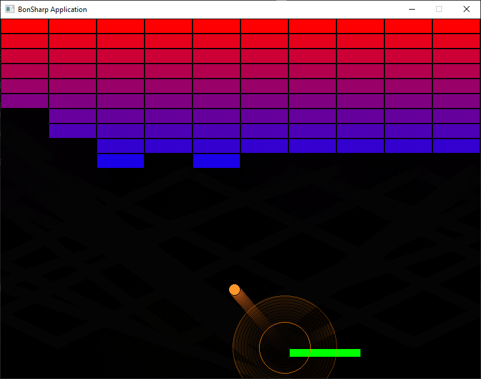

# Breakout

This scene implements a simple Breakout game without using any loaded assets. Run this scene from any `BonEngine` application and it will work.



```cs
using System;
using System.Collections.Generic;
using BonEngineSharp.Framework;
using BonEngineSharp.Assets;
using BonEngineSharp.Defs;

/// <summary>
/// Implements a breakout minigame.
/// </summary>
class BreakoutGame : BonEngineSharp.Scene
{
    // ball position
    PointF _ballPosition;
    PointF _ballSpeed;
    int _ballRadius = 10;

    // is the ball below player, ie a strike?
    bool _isBallOut;

    // player rect
    RectangleF _player;

    // trail effect texture
    ImageAsset _trailEffectTexture;

    // explosion effects
    class Explosion
    {
        public PointF Position;
        public Color Color;
        public float Radius;
    }
    List<Explosion> _explosions = new List<Explosion>();

    // blocks
    class Block
    {
        public RectangleI Rectangle;
        public Color Color;
    }
    List<Block> _blocks = new List<Block>();

    // block size
    PointI BlockSize = new PointI(80, 25);

    // start the scene
    protected override void Start()
    {
        // set level and starting positions
        _ballPosition.Set(400, 500);
        _ballSpeed.Set(-1f, -0.75f);

        // init player
        var windowSize = Gfx.WindowSize;
        _player = new RectangleF(windowSize.X / 2 - 60, windowSize.Y - 50, 120, 15);

        // init level
        for (int i = 0; i < windowSize.X / BlockSize.X; ++i)
        {
            for (int j = 0; j < 10; ++j)
            {
                _blocks.Add(new Block()
                {
                    Rectangle = new RectangleI(i * BlockSize.X, j * BlockSize.Y, BlockSize.X, BlockSize.Y),
                    Color = new Color(1f - (j / 10f), 0f, (j / 10f) - 1f, 1f)
                });
            }
        }

        // create empty texture for trail effects
        _trailEffectTexture = Assets.CreateEmptyImage(windowSize);
    }

    // on updates do animations and controls
    protected override void Update(double deltaTime)
    {
        // if user click 'exit' action, exit game
        if (Input.Down("exit"))
        {
            Game.Exit();
        }

        // skip frames with too much delta
        if (deltaTime > 1) { return; }

        // get window size
        var windowSize = Gfx.WindowSize;

        // move ball
        _ballPosition.AddSelf(_ballSpeed.Multiply((float)deltaTime * 235f));
        if (_ballPosition.X < 0) { _ballSpeed.X = Math.Abs(_ballSpeed.X); }
        if (_ballPosition.X > windowSize.X) { _ballSpeed.X = -Math.Abs(_ballSpeed.X); }
        if (_ballPosition.Y < 0) { _ballSpeed.Y = Math.Abs(_ballSpeed.Y); }
        if (_ballPosition.Y > windowSize.Y + 250) { _ballSpeed.Y = -Math.Abs(_ballSpeed.Y); }
        _isBallOut = _ballPosition.Y > windowSize.Y;

        // if ball out, reset speed
        if (_isBallOut && Math.Abs(_ballSpeed.X) > 1f)
        {
            _ballSpeed.X = 1;
        }

        // update explosions
        foreach (Explosion exp in _explosions)
        {
            if (exp.Radius > 10) { exp.Color.A -= (float)deltaTime * 1.25f; }
            exp.Radius += (float)deltaTime * 150f;
        }
        _explosions.RemoveAll(x => x.Color.A < 0);

        // player movement speed
        var playerSpeed = 350f;
        float playerVelocity = 0f;

        // do player movement
        if (!_isBallOut)
        {
            // move player left
            if (_player.Left > 0 && Input.Down("left"))
            {
                playerVelocity -= (float)deltaTime * playerSpeed;
            }
            // move player right
            if (_player.Right < windowSize.X && Input.Down("right"))
            {
                playerVelocity += (float)deltaTime * playerSpeed;
            }
        }

        // update player position
        _player.X += playerVelocity;

        // test collision with blocks
        Block collidedBlock = null;
        foreach (var block in _blocks)
        {
            // check collision with block + some extra margin
            var rect = block.Rectangle;
            rect.X -= 5;
            rect.Width += 10;
            rect.Y -= 5;
            rect.Height += 10;

            // ball hit block
            if (rect.Contains(_ballPosition))
            {
                AddExplosion(_ballPosition, block.Color);
                collidedBlock = block;
                if ((_ballPosition.Y < block.Rectangle.Top + 6) || (_ballPosition.Y > block.Rectangle.Bottom - 6))
                {
                    _ballSpeed.Y *= -1;
                }
                if ((_ballPosition.X < block.Rectangle.Left + 5) || (_ballPosition.X > block.Rectangle.Right - 5))
                {
                    _ballSpeed.X *= -1;
                }
                break;
            }
        }
        if (collidedBlock != null) { _blocks.Remove(collidedBlock); }

        // test collision with player paddle
        if (_ballSpeed.Y > 0)
        {
            // create a slightly larger rect for player collision
            var playerCollision = _player;
            playerCollision.X -= 10;
            playerCollision.Width += 10;
            playerCollision.Y -= 10;
            playerCollision.Height += 15;

            // check if hit ball
            if (playerCollision.Contains(_ballPosition))
            {
                // update ball speed
                _ballSpeed.Y = -_ballSpeed.Y;
                _ballSpeed.X += playerVelocity * 0.1f;

                // special case for corners
                if (_ballPosition.X < _player.Left + 10)
                {
                    if (_ballSpeed.X > 0) _ballSpeed.X = 0f;
                    _ballSpeed.X -= 0.65f;
                    AddExplosion(_ballPosition, new Color(1f, 0.5f, 0f, 1f));
                }
                else if (_ballPosition.X > _player.Right - 10)
                {
                    if (_ballSpeed.X < 0) _ballSpeed.X = 0f;
                    _ballSpeed.X += 0.65f;
                    AddExplosion(_ballPosition, new Color(1f, 0.5f, 0f, 1f));
                }
            }
        }
    }

    // adds an explosion effect
    private void AddExplosion(PointF position, Color color)
    {
        _explosions.Add(new Explosion()
        {
            Color = color,
            Position = position,
            Radius = 5,
        });
    }

    // draw scene
    protected override void Draw()
    {
        // draw trail effects on texture
        Gfx.SetRenderTarget(_trailEffectTexture);
        Gfx.DrawCircle(_ballPosition, _ballRadius, new Color(0.75f, 0.35f, 0.1f), true);
        foreach (var explosion in _explosions)
        {
            Gfx.DrawCircle(explosion.Position, (int)(explosion.Radius), explosion.Color, false);
        }

        // make older trails fade out
        Gfx.DrawRectangle(new RectangleI(0, 0, Gfx.WindowSize.X, Gfx.WindowSize.Y), new Color(0.9f, 0.9f, 0.9f, 1f), true, BlendModes.Multiply);
        Gfx.SetRenderTarget(null);

        // clear screen
        Gfx.ClearScreen(_isBallOut ? Color.Red : Color.Black);

        // draw blocks
        foreach (var block in _blocks)
        {
            Gfx.DrawRectangle(block.Rectangle, block.Color, true);
            Gfx.DrawRectangle(block.Rectangle, Color.Black, false);
        }

        // present trail on screen
        Gfx.DrawImage(_trailEffectTexture, PointF.Zero, BlendModes.Additive);

        // draw player
        Gfx.DrawRectangle(_player, Color.Green, true);
        Gfx.DrawRectangle(_player, Color.Black, false);

        // draw ball
        var brightness = (float)Math.Abs(Math.Sin((float)Game.ElapsedTime * 2));
        Gfx.DrawCircle(_ballPosition, _ballRadius, new Color(1f, 0.5f + brightness / 2f, brightness), true);
        Gfx.DrawCircle(_ballPosition, _ballRadius, Color.Black, false);

        // draw explosions
        foreach (var explosion in _explosions)
        {
            // outter circle
            Gfx.DrawCircle(explosion.Position, (int)(explosion.Radius), explosion.Color, false);

            // inner circle
            var color = explosion.Color;
            if (color.A < 0.5) { color.A += 0.5f; }
            Gfx.DrawCircle(explosion.Position, (int)(explosion.Radius) / 2, color, false);
        }
    }
}
```